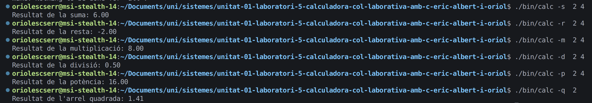

[](https://classroom.github.com/a/bxb1jFbT)

# Calculadora en C

Aquest projecte és una **calculadora de línia de comandes** implementada en llenguatge **C**. Permet realitzar operacions matemàtiques bàsiques i avançades utilitzant **opcions i arguments** des de la terminal.

## Membres de l’equip
- Albert Mas
- Eric Buenavida
- Oriol Escolà

##  Funcionalitats
La calculadora suporta les següents operacions:
- + **Suma** de dos números  
- - **Resta** de dos números  
- x **Multiplicació** de dos números  
- / **Divisió** de dos números (control de divisió per zero)  
- √ **Arrel quadrada** d’un número (només positius)  
- ^ **Potència** (`NUM^BASE`)  

## Exemple d'execució
  

## Compilació i execució

1. Anar a la carpeta i executar:
   ```bash
     Make
   ```
2. A continuació posar:
   ```bash
   ./bin/calc [OPCIONS]
   ```
   
Opcions:
- -s, --suma NUM1 NUM2        Suma de dos números
- -r, --resta NUM1 NUM2       Resta de dos números
- -m, --multiplicacio NUM1 NUM2 Multiplicació de dos números
- -d, --divisio NUM1 NUM2     Divisió de dos números
- -q, --arrel NUM             Arrel quadrada d'un número
- -p, --potencia NUM BASE     Potència (NUM^BASE)
- -h, --help                  Mostra aquest missatge d'ajuda

